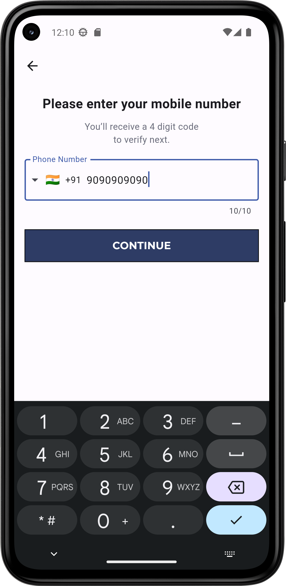
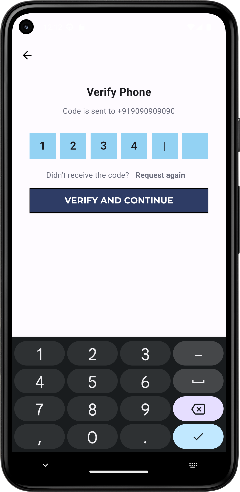
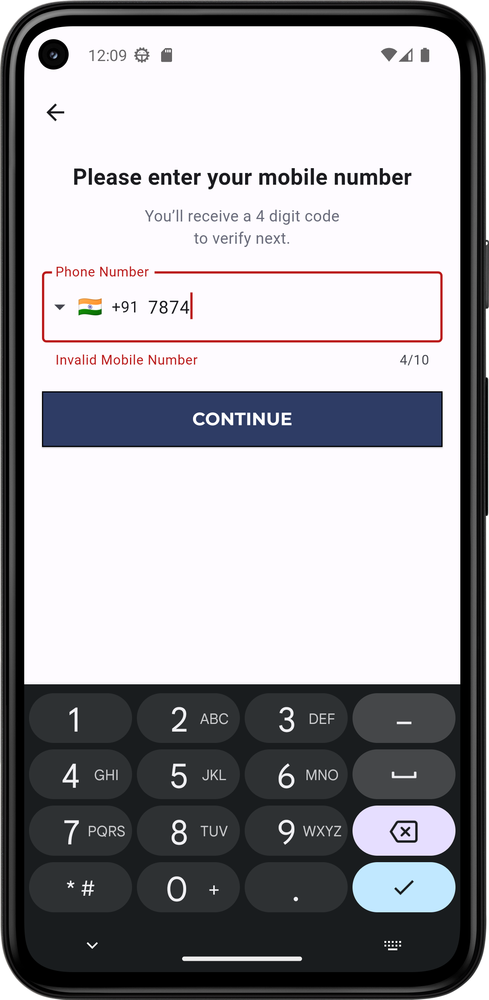
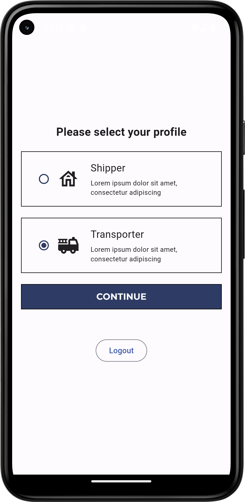
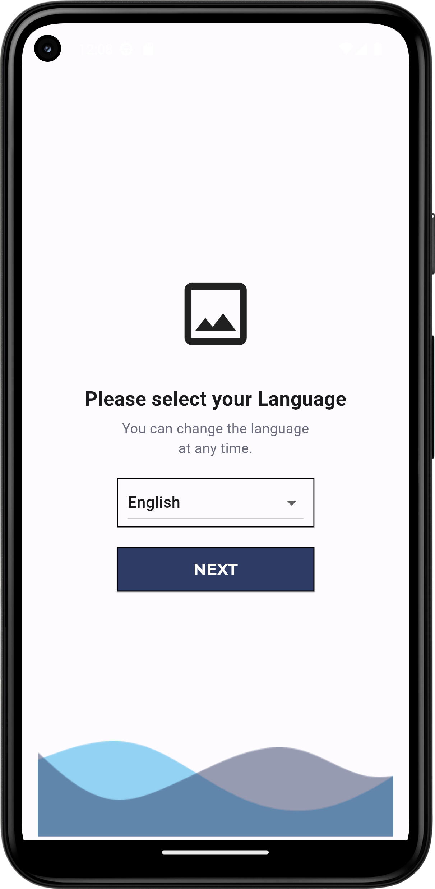

# flutter-firebase-phone-auth

Flutter app which demonstrates phone authentication using Firebase

## Sample Images
<p align="center">
  
  
  
  
  
</p>

## Install, build and run!
To clone and run this application, you'll need [Git](https://git-scm.com) installed on your computer. From your command line:

```bash
# Clone this repository
$ git clone https://github.com/04ac/flutter-firebase-phone-auth

# Go into the repository
$ cd flutter-firebase-phone-auth
```

Download Android Studio or Visual Studio Code with Flutter editor plugins. After that, open the project and install dependencies from ```pubspec.yaml``` by running the following command:
```bash
$ flutter pub get
```


## Built With

This software was built using the following:

- [Flutter](https://flutter.dev/)
- [Dart](https://dart.dev/)
- [Android Studio](https://developer.android.com/studio)
